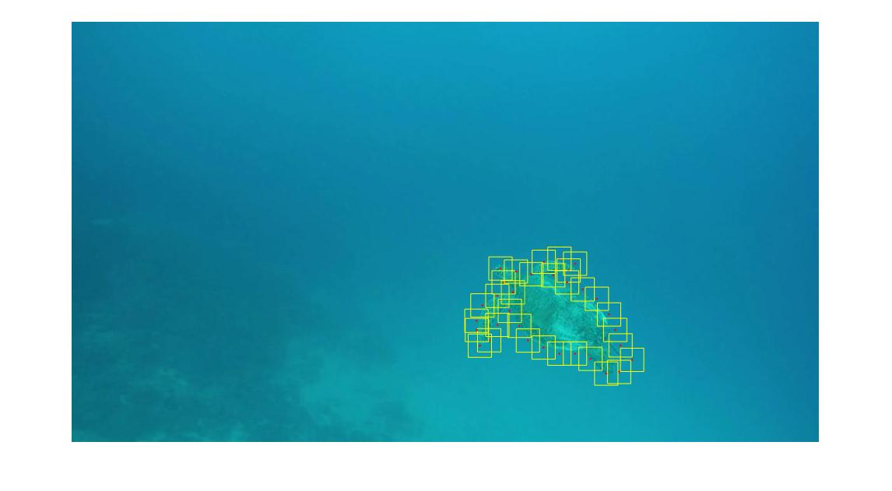

# Rotobrush

A pipeline for video object segmentation. Given the boundary of an object in the initial frame of a video, 
the system will track the object’s boundary through the subsequent frames. 
The system will be based on the SnapCut algorithm which powers the Rotobrush tool in Adobe AfterEffects! 

